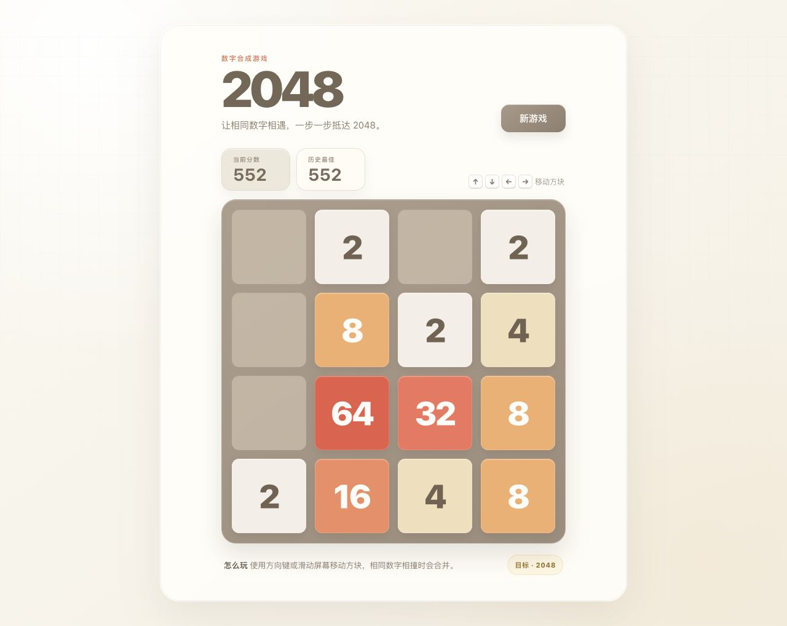

# 2048

一款明亮暖色风格的 2048 网页游戏，支持键盘方向键与移动端滑动操作。

[在线体验](https://jarvin-lab-2048.pages.dev/)



## 功能

- 完整的 2048 合并与计分逻辑
- 本地保存历史最佳分数
- 键盘方向键和触屏滑动操作
- 新方块、移动、合并与边缘反馈动效
- 桌面端和移动端响应式布局
- 尊重系统的“减少动态效果”设置

## 本地开发

需要 Node.js 22.12 或更高版本。

```bash
npm install
npm run dev
```

Vite 会在终端输出本地访问地址。

## 构建

```bash
npm run check
npm run build
npm run preview
```

生产文件会输出到 `dist/`。项目使用相对资源路径，可部署到 GitHub Pages 的仓库子路径。

## 项目结构

```text
.
├── index.html          # 页面入口与语义结构
├── public/
│   └── favicon.png     # 浏览器标签与移动端图标
├── docs/
│   └── gameplay.png    # README 游戏界面截图
├── src/
│   ├── main.js         # 游戏状态、交互与渲染逻辑
│   └── styles.css      # 视觉系统、动效与响应式样式
├── vite.config.js      # 构建配置
└── package.json        # 脚本与依赖
```
